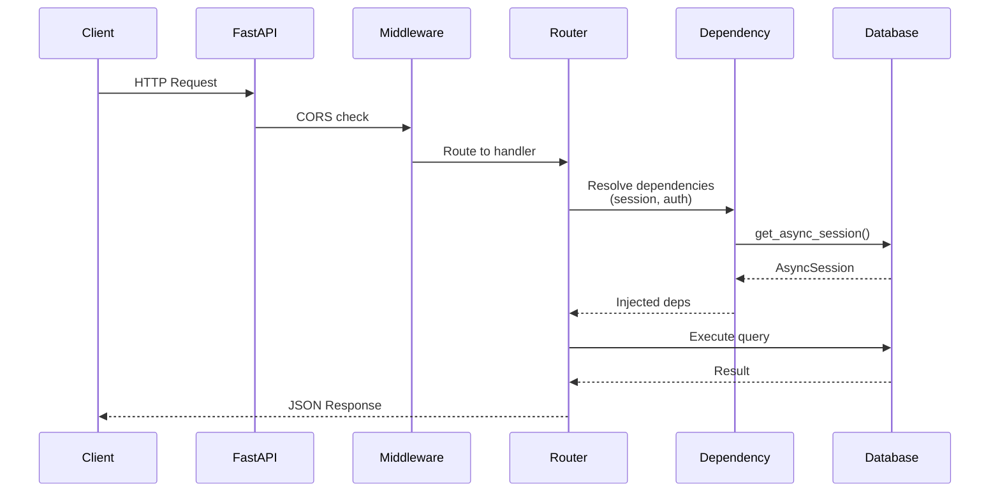
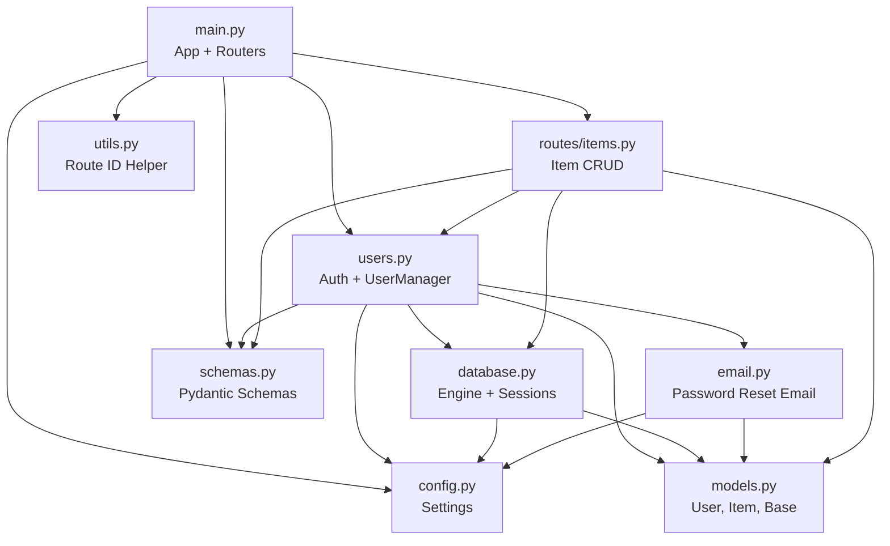

# Backend Architecture

This page provides an in-depth overview of the FastAPI backend — its module structure, request lifecycle, database layer, authentication system, and supporting services.

## Project Structure

```
fastapi_backend/
├── app/
│   ├── main.py            # FastAPI app creation, middleware, router registration
│   ├── config.py          # Settings (Pydantic BaseSettings) loaded from .env
│   ├── database.py        # Async SQLAlchemy engine, session factory, dependencies
│   ├── models.py          # SQLAlchemy ORM models (User, Item, Base)
│   ├── schemas.py         # Pydantic schemas for request/response validation
│   ├── users.py           # fastapi-users integration (UserManager, JWT auth)
│   ├── email.py           # Email sending via fastapi-mail
│   ├── utils.py           # Utility functions (route ID generation)
│   ├── email_templates/   # Jinja2 HTML templates for emails
│   └── routes/
│       └── items.py       # CRUD endpoints for items
├── commands/
│   └── generate_openapi_schema.py  # CLI script to export OpenAPI JSON
├── migrations/            # Alembic migration files
├── tests/
│   ├── conftest.py        # Shared pytest-asyncio fixtures
│   └── test_*.py          # Test modules
├── watcher.py             # File watcher for auto-regenerating OpenAPI schema
├── start.sh               # Dev server startup script (FastAPI + watcher)
├── Dockerfile             # Production container image
├── alembic.ini            # Alembic configuration
└── pyproject.toml         # Project dependencies and tool config
```

## Application Lifecycle

The FastAPI application is created in `app/main.py`:

1. **App instantiation** — A `FastAPI` instance is created with a custom `generate_unique_id_function` (for clean OpenAPI operation IDs) and a configurable `openapi_url`.
2. **CORS middleware** — `CORSMiddleware` is added using origins from `settings.CORS_ORIGINS`.
3. **Router registration** — Authentication routers (from `fastapi-users`) and the items router are mounted with appropriate prefixes.
4. **Pagination** — `fastapi-pagination` is configured via `add_pagination(app)`.

### Development Server

The `start.sh` script runs two processes in parallel:

- **FastAPI dev server** — `fastapi dev app/main.py` with hot-reload enabled
- **File watcher** — `watcher.py` monitors `app/` for changes to `main.py`, `schemas.py`, or any file in `routes/`. On change it runs mypy type checks and regenerates the OpenAPI schema.

## Request Flow



## Module Dependencies



## Database Layer

The database layer (`app/database.py`) uses **async SQLAlchemy** with the `asyncpg` driver:

- **Engine** — Created with `create_async_engine` using `NullPool` (optimised for serverless environments like Vercel where persistent connection pools are not viable).
- **Session factory** — `async_sessionmaker` produces `AsyncSession` instances with configurable `expire_on_commit`.
- **`get_async_session`** — A FastAPI dependency that yields a session per request and ensures cleanup.
- **`get_user_db`** — Wraps the session with `SQLAlchemyUserDatabase` for `fastapi-users` operations.
- **`create_db_and_tables`** — Creates all tables from `Base.metadata` (used in tests; production uses Alembic migrations).

### Database URL Handling

The `DATABASE_URL` setting is parsed via `urllib.parse.urlparse` and reconstructed as an `asyncpg` connection string (`postgresql+asyncpg://...`). This allows storing a standard PostgreSQL URL in the environment while using the async driver.

### Migrations

Database schema changes are managed through **Alembic**:

```bash
# Generate a new migration after modifying models
uv run alembic revision --autogenerate -m "description"

# Apply pending migrations
uv run alembic upgrade head
```

The migration environment is configured in `alembic.ini` and `migrations/env.py`.

## Models

All models extend `Base` (a `DeclarativeBase` subclass) defined in `app/models.py`:

### User

Inherits from `SQLAlchemyBaseUserTableUUID` (provided by `fastapi-users`), which adds:

| Column | Type | Description |
|---|---|---|
| `id` | `UUID` | Primary key (auto-generated) |
| `email` | `String` | Unique email address |
| `hashed_password` | `String` | Bcrypt-hashed password |
| `is_active` | `Boolean` | Account active flag |
| `is_superuser` | `Boolean` | Superuser flag |
| `is_verified` | `Boolean` | Email verified flag |

Additionally, `User` defines a one-to-many relationship to `Item` with `cascade="all, delete-orphan"`.

### Item

| Column | Type | Description |
|---|---|---|
| `id` | `UUID` | Primary key (auto-generated via `uuid4`) |
| `name` | `String` | Item name (required) |
| `description` | `String` | Optional description |
| `quantity` | `Integer` | Optional quantity |
| `user_id` | `UUID` | Foreign key to `user.id` |

## Authentication System

Authentication is powered by [fastapi-users](https://fastapi-users.github.io/fastapi-users/) and configured in `app/users.py`:

### JWT Strategy

- **Transport** — `BearerTransport` with `tokenUrl` pointing to `auth/jwt/login`
- **Strategy** — `JWTStrategy` using `ACCESS_SECRET_KEY` with a configurable `ACCESS_TOKEN_EXPIRE_SECONDS` (default: 3600s / 1 hour)
- **Backend** — An `AuthenticationBackend` named `"jwt"` combining the transport and strategy

### UserManager

The `UserManager` handles user lifecycle events and password validation:

- **`on_after_register`** — Logs the new user ID
- **`on_after_forgot_password`** — Sends a password reset email via `send_reset_password_email`
- **`on_after_request_verify`** — Logs the verification token
- **`validate_password`** — Enforces password rules:
    - Minimum 8 characters
    - Must not contain the user's email
    - At least one uppercase letter
    - At least one special character (`!@#$%^&*(),.?":{}|<>`)

### Obtaining the Current User

The `current_active_user` dependency (from `fastapi_users.current_user(active=True)`) is used in route handlers to require authentication and inject the authenticated `User` object.

## Email Subsystem

Email functionality is provided by [fastapi-mail](https://sabuhish.github.io/fastapi-mail/) in `app/email.py`:

- **Configuration** — `ConnectionConfig` is built from `Settings` fields (SMTP server, credentials, TLS settings)
- **Templates** — Jinja2 HTML templates stored in `app/email_templates/`
- **Password Reset** — `send_reset_password_email(user, token)` constructs a reset link pointing to `{FRONTEND_URL}/password-recovery/confirm?token=...` and sends it using the `password_reset.html` template

## OpenAPI Schema Generation

The OpenAPI schema powers the frontend's auto-generated typed API client:

1. **Generation script** — `commands/generate_openapi_schema.py` calls `app.openapi()`, cleans up operation IDs by removing tag prefixes, and writes the JSON to the path specified by `OPENAPI_OUTPUT_FILE`.
2. **Auto-regeneration** — `watcher.py` uses `watchdog` to monitor file changes in `app/` and re-runs the generation script automatically during development.
3. **Frontend consumption** — The generated schema is used by `openapi-fetch` on the frontend to create a fully typed API client.

## Configuration

All settings are defined in `app/config.py` using Pydantic's `BaseSettings`. Values are loaded from environment variables with fallback to a `.env` file.

| Group | Variable | Type | Default | Description |
|---|---|---|---|---|
| **OpenAPI** | `OPENAPI_URL` | `str` | `"/openapi.json"` | Path to serve the OpenAPI schema |
| **Database** | `DATABASE_URL` | `str` | — | PostgreSQL connection URL |
| | `TEST_DATABASE_URL` | `str?` | `None` | Separate database URL for tests |
| | `EXPIRE_ON_COMMIT` | `bool` | `False` | SQLAlchemy session behaviour |
| **Auth** | `ACCESS_SECRET_KEY` | `str` | — | JWT signing secret |
| | `RESET_PASSWORD_SECRET_KEY` | `str` | — | Password reset token secret |
| | `VERIFICATION_SECRET_KEY` | `str` | — | Email verification token secret |
| | `ALGORITHM` | `str` | `"HS256"` | JWT algorithm |
| | `ACCESS_TOKEN_EXPIRE_SECONDS` | `int` | `3600` | Token lifetime in seconds |
| **Email** | `MAIL_USERNAME` | `str?` | `None` | SMTP username |
| | `MAIL_PASSWORD` | `str?` | `None` | SMTP password |
| | `MAIL_FROM` | `str?` | `None` | Sender email address |
| | `MAIL_SERVER` | `str?` | `None` | SMTP server hostname |
| | `MAIL_PORT` | `int?` | `None` | SMTP port |
| | `MAIL_FROM_NAME` | `str` | `"FastAPI template"` | Display name for sender |
| | `MAIL_STARTTLS` | `bool` | `True` | Use STARTTLS |
| | `MAIL_SSL_TLS` | `bool` | `False` | Use SSL/TLS |
| **Frontend** | `FRONTEND_URL` | `str` | `"http://localhost:3000"` | Frontend base URL (used in emails) |
| **CORS** | `CORS_ORIGINS` | `Set[str]` | — | Allowed CORS origins |
