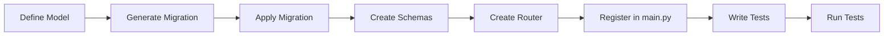

# Backend Development Guide

This guide walks you through common development tasks: adding models, creating new API routes, writing tests, and managing configuration. For architecture context, see the [Backend Architecture](backend-architecture.md) page.

---

## Adding a New Model

### 1. Define the model

Add your SQLAlchemy model in `fastapi_backend/app/models.py`:

```python
from sqlalchemy import Column, String, Integer, ForeignKey
from sqlalchemy.dialects.postgresql import UUID
from sqlalchemy.orm import relationship
from uuid import uuid4

class Task(Base):
    __tablename__ = "tasks"

    id = Column(UUID(as_uuid=True), primary_key=True, default=uuid4)
    title = Column(String, nullable=False)
    status = Column(String, default="pending")
    user_id = Column(UUID(as_uuid=True), ForeignKey("user.id"), nullable=False)

    user = relationship("User", back_populates="tasks")
```

If the model belongs to a user, add the reverse relationship on the `User` model:

```python
class User(SQLAlchemyBaseUserTableUUID, Base):
    items = relationship("Item", back_populates="user", cascade="all, delete-orphan")
    tasks = relationship("Task", back_populates="user", cascade="all, delete-orphan")  # new
```

### 2. Generate a migration

```bash
cd fastapi_backend
uv run alembic revision --autogenerate -m "add tasks table"
```

### 3. Apply the migration

```bash
uv run alembic upgrade head
```

!!! tip
    Always review the auto-generated migration file in `migrations/versions/` before applying it.

---

## Adding a New Route

### 1. Define Pydantic schemas

Add request/response schemas in `fastapi_backend/app/schemas.py`:

```python
class TaskBase(BaseModel):
    title: str
    status: str = "pending"

class TaskCreate(TaskBase):
    pass

class TaskRead(TaskBase):
    id: UUID
    user_id: UUID

    model_config = {"from_attributes": True}
```

### 2. Create the router

Create a new file `fastapi_backend/app/routes/tasks.py`:

```python
from uuid import UUID
from fastapi import APIRouter, Depends, HTTPException
from sqlalchemy.ext.asyncio import AsyncSession
from sqlalchemy.future import select

from app.database import get_async_session
from app.database import User
from app.models import Task
from app.schemas import TaskCreate, TaskRead
from app.users import current_active_user

router = APIRouter(tags=["task"])


@router.get("/", response_model=list[TaskRead])
async def list_tasks(
    db: AsyncSession = Depends(get_async_session),
    user: User = Depends(current_active_user),
):
    result = await db.execute(select(Task).filter(Task.user_id == user.id))
    tasks = result.scalars().all()
    return [TaskRead.model_validate(task) for task in tasks]


@router.post("/", response_model=TaskRead)
async def create_task(
    task: TaskCreate,
    db: AsyncSession = Depends(get_async_session),
    user: User = Depends(current_active_user),
):
    db_task = Task(**task.model_dump(), user_id=user.id)
    db.add(db_task)
    await db.commit()
    await db.refresh(db_task)
    return db_task
```

### 3. Register the router

In `fastapi_backend/app/main.py`, import and include the new router:

```python
from app.routes.tasks import router as tasks_router

# After the items router
app.include_router(tasks_router, prefix="/tasks")
```

### 4. Update schema imports

If the new schemas are used in `main.py`, add them to the imports. The schemas are also exposed for the frontend via the OpenAPI schema which is automatically regenerated by the file watcher.

---

## Writing Tests

Tests use `pytest` with `pytest-asyncio` for async support and `httpx.AsyncClient` for making requests against the app.

### Test Architecture

The test setup in `tests/conftest.py` provides three key fixtures:

| Fixture | Description |
|---|---|
| `db_session` | A fresh `AsyncSession` connected to the test database. Rolls back after each test. |
| `test_client` | An `httpx.AsyncClient` wired to the FastAPI app with database dependencies overridden to use the test session. |
| `authenticated_user` | Creates a test user in the database, generates a JWT token, and returns a dict with `headers`, `user`, and `user_data`. |

### Writing a Test

Create a new file or add to an existing one in `tests/`:

```python
import pytest


@pytest.mark.asyncio
async def test_create_task(test_client, authenticated_user):
    response = await test_client.post(
        "/tasks/",
        json={"title": "My Task", "status": "pending"},
        headers=authenticated_user["headers"],
    )
    assert response.status_code == 200
    data = response.json()
    assert data["title"] == "My Task"
    assert data["user_id"] == str(authenticated_user["user"].id)


@pytest.mark.asyncio
async def test_create_task_unauthenticated(test_client):
    response = await test_client.post(
        "/tasks/",
        json={"title": "My Task"},
    )
    assert response.status_code == 401
```

### Key Patterns

- **All test functions must be `async`** and decorated with `@pytest.mark.asyncio`
- **Use `authenticated_user["headers"]`** to authenticate requests
- **Access the user object** via `authenticated_user["user"]` for assertions
- **Database isolation** — Each test gets a fresh database with tables created/dropped per function

### Running Tests

```bash
# Run backend tests locally
cd fastapi_backend
uv run pytest

# Or using the Makefile from the project root
make test-backend

# With Docker
make docker-test-backend
```

For more test configuration options, see [Additional Settings](additional-settings.md).

---

## Managing Configuration

### Adding a New Setting

1. Add the field to the `Settings` class in `fastapi_backend/app/config.py`:

    ```python
    class Settings(BaseSettings):
        # ... existing settings ...

        # New setting
        MY_NEW_SETTING: str = "default_value"
    ```

2. Add the environment variable to your `.env` file:

    ```dotenv
    MY_NEW_SETTING=my_value
    ```

3. Use the setting in your code:

    ```python
    from app.config import settings

    print(settings.MY_NEW_SETTING)
    ```

### Setting Types

Pydantic `BaseSettings` supports automatic type coercion:

| Python Type | Environment Value | Example |
|---|---|---|
| `str` | Plain string | `MY_VAR=hello` |
| `int` | Numeric string | `MY_VAR=42` |
| `bool` | `true`/`false`/`1`/`0` | `MY_VAR=true` |
| `Set[str]` | JSON array | `MY_VAR=["a","b"]` |
| `str \| None` | Empty or omitted | `MY_VAR=` |

---

## Development Workflow Summary



1. **Define your model** in `models.py`
2. **Generate and apply** an Alembic migration
3. **Create Pydantic schemas** in `schemas.py`
4. **Create a router** in `routes/`
5. **Register** the router in `main.py`
6. **Write tests** using the provided fixtures
7. **Run tests** to verify everything works

The file watcher will automatically regenerate the OpenAPI schema when you modify files in `app/`, keeping the frontend typed client in sync.
