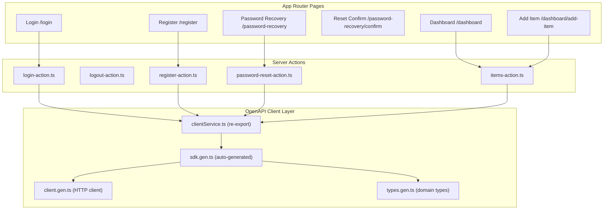

# Next.js Frontend Walkthrough

## Project Overview

The **Next.js frontend** lives in [`nextjs-frontend/`](file:///Users/orbot/Developer/work/nextjs-fastapi-template/nextjs-frontend) inside a monorepo alongside a FastAPI backend. It is a **Next.js 15 App Router** application (React 19) that communicates with the FastAPI backend via an **auto-generated OpenAPI client**.

### Key Technologies

| Layer | Technology |
|---|---|
| Framework | Next.js 15 (App Router, Turbopack) |
| UI | shadcn/ui + Radix UI + Tailwind CSS 4 |
| API Client | `@hey-api/openapi-ts` (auto-generated from backend OpenAPI spec) |
| Validation | Zod |
| Auth | JWT cookie-based (`accessToken` cookie) |
| Testing | Vitest + React Testing Library |
| Fonts | Geist + Geist Mono (self-hosted `.woff`) |

---

## Architecture



---

## OpenAPI Client (Auto-Generated)

The API client is generated from the backend's OpenAPI specification using `@hey-api/openapi-ts`. All generated code lives in [`app/openapi-client/`](file:///Users/orbot/Developer/work/nextjs-fastapi-template/nextjs-frontend/app/openapi-client).

### Key Files

- [types.gen.ts](file:///Users/orbot/Developer/work/nextjs-fastapi-template/nextjs-frontend/app/openapi-client/types.gen.ts) — Domain types (`ItemRead`, `UserRead`, `BearerResponse`, `PageItemRead`, etc.)
- [sdk.gen.ts](file:///Users/orbot/Developer/work/nextjs-fastapi-template/nextjs-frontend/app/openapi-client/sdk.gen.ts) — Typed SDK functions (14 endpoints)
- [client.gen.ts](file:///Users/orbot/Developer/work/nextjs-fastapi-template/nextjs-frontend/app/openapi-client/client.gen.ts) — Pre-configured HTTP client with `baseUrl` from environment
- [clientService.ts](file:///Users/orbot/Developer/work/nextjs-fastapi-template/nextjs-frontend/app/clientService.ts) — Re-exports SDK functions for clean imports

### API Endpoints

| Function | Method | Path | Auth |
|---|---|---|---|
| `authJwtLogin` | POST | `/auth/jwt/login` | No |
| `authJwtLogout` | POST | `/auth/jwt/logout` | Bearer |
| `registerRegister` | POST | `/auth/register` | No |
| `resetForgotPassword` | POST | `/auth/forgot-password` | No |
| `resetResetPassword` | POST | `/auth/reset-password` | No |
| `verifyRequestToken` | POST | `/auth/request-verify-token` | No |
| `verifyVerify` | POST | `/auth/verify` | No |
| `usersCurrentUser` | GET | `/users/me` | Bearer |
| `usersPatchCurrentUser` | PATCH | `/users/me` | Bearer |
| `usersDeleteUser` | DELETE | `/users/{id}` | Bearer |
| `usersUser` | GET | `/users/{id}` | Bearer |
| `usersPatchUser` | PATCH | `/users/{id}` | Bearer |
| `readItem` | GET | `/items/` | Bearer |
| `createItem` | POST | `/items/` | Bearer |
| `deleteItem` | DELETE | `/items/{item_id}` | Bearer |

### Client Configuration

The base URL is configured in [clientConfig.ts](file:///Users/orbot/Developer/work/nextjs-fastapi-template/nextjs-frontend/lib/clientConfig.ts):

```typescript
export const getClientConfig = () => ({
  baseUrl: process.env.NEXT_PUBLIC_API_BASE_URL || "http://localhost:8000",
});
```

---

## Authentication Flow

Authentication uses **JWT tokens stored in cookies** — managed entirely through server actions.

### Login Flow

1. User submits email/password on [`/login`](file:///Users/orbot/Developer/work/nextjs-fastapi-template/nextjs-frontend/app/login/page.tsx)
2. [login-action.ts](file:///Users/orbot/Developer/work/nextjs-fastapi-template/nextjs-frontend/components/actions/login-action.ts) validates with Zod → calls `authJwtLogin` → stores `access_token` in cookie
3. Redirects to `/dashboard`

### Logout Flow

1. [logout-action.ts](file:///Users/orbot/Developer/work/nextjs-fastapi-template/nextjs-frontend/components/actions/logout-action.ts) reads token from cookie → calls `authJwtLogout` → deletes cookie
2. Redirects to `/login`

### Password Reset

1. [`/password-recovery`](file:///Users/orbot/Developer/work/nextjs-fastapi-template/nextjs-frontend/app/password-recovery/page.tsx) — enter email → `resetForgotPassword`
2. [`/password-recovery/confirm?token=...`](file:///Users/orbot/Developer/work/nextjs-fastapi-template/nextjs-frontend/app/password-recovery/confirm/page.tsx) — enter new password → `resetResetPassword`

> [!NOTE]
> There is **no middleware-based auth guard**. Protected routes rely on server actions checking for the `accessToken` cookie and returning early if missing.

---

## Server Actions

All server actions live in [`components/actions/`](file:///Users/orbot/Developer/work/nextjs-fastapi-template/nextjs-frontend/components/actions) and follow a consistent pattern:

1. **Zod validation** of form data
2. **API call** via the OpenAPI client
3. **Error handling** with structured return types (`errors`, `server_validation_error`, `server_error`)
4. **Redirect** on success

| Action | File | Validates | API Call |
|---|---|---|---|
| `login` | [login-action.ts](file:///Users/orbot/Developer/work/nextjs-fastapi-template/nextjs-frontend/components/actions/login-action.ts) | `loginSchema` | `authJwtLogin` |
| `logout` | [logout-action.ts](file:///Users/orbot/Developer/work/nextjs-fastapi-template/nextjs-frontend/components/actions/logout-action.ts) | — | `authJwtLogout` |
| `register` | [register-action.ts](file:///Users/orbot/Developer/work/nextjs-fastapi-template/nextjs-frontend/components/actions/register-action.ts) | `registerSchema` | `registerRegister` |
| `fetchItems` | [items-action.ts](file:///Users/orbot/Developer/work/nextjs-fastapi-template/nextjs-frontend/components/actions/items-action.ts) | — | `readItem` |
| `addItem` | [items-action.ts](file:///Users/orbot/Developer/work/nextjs-fastapi-template/nextjs-frontend/components/actions/items-action.ts) | `itemSchema` | `createItem` |
| `removeItem` | [items-action.ts](file:///Users/orbot/Developer/work/nextjs-fastapi-template/nextjs-frontend/components/actions/items-action.ts) | — | `deleteItem` |
| `passwordReset` | [password-reset-action.ts](file:///Users/orbot/Developer/work/nextjs-fastapi-template/nextjs-frontend/components/actions/password-reset-action.ts) | — | `resetForgotPassword` |
| `passwordResetConfirm` | [password-reset-action.ts](file:///Users/orbot/Developer/work/nextjs-fastapi-template/nextjs-frontend/components/actions/password-reset-action.ts) | `passwordResetConfirmSchema` | `resetResetPassword` |

---

## Validation Schemas

Defined in [definitions.ts](file:///Users/orbot/Developer/work/nextjs-fastapi-template/nextjs-frontend/lib/definitions.ts) using Zod:

| Schema | Fields | Rules |
|---|---|---|
| `loginSchema` | `username`, `password` | email format, min 3 chars password |
| `registerSchema` | `email`, `password` | email format, min 3 chars password |
| `passwordResetConfirmSchema` | `token`, `password`, `passwordConfirm` | min 3 chars, passwords match (`.refine`) |
| `itemSchema` | `name`, `description`, `quantity` | min 1 char name, quantity coerced to number ≥ 0 |

---

## Page Routes

### Public Pages

| Route | File | Purpose |
|---|---|---|
| `/` | [page.tsx](file:///Users/orbot/Developer/work/nextjs-fastapi-template/nextjs-frontend/app/page.tsx) | Landing — links to login |
| `/login` | [login/page.tsx](file:///Users/orbot/Developer/work/nextjs-fastapi-template/nextjs-frontend/app/login/page.tsx) | Login form |
| `/register` | [register/page.tsx](file:///Users/orbot/Developer/work/nextjs-fastapi-template/nextjs-frontend/app/register/page.tsx) | Registration form |
| `/password-recovery` | [password-recovery/page.tsx](file:///Users/orbot/Developer/work/nextjs-fastapi-template/nextjs-frontend/app/password-recovery/page.tsx) | Request password reset email |
| `/password-recovery/confirm` | [password-recovery/confirm/page.tsx](file:///Users/orbot/Developer/work/nextjs-fastapi-template/nextjs-frontend/app/password-recovery/confirm/page.tsx) | Set new password (requires `?token=` query param) |

### Protected Pages (Dashboard)

| Route | File | Purpose |
|---|---|---|
| `/dashboard` | [dashboard/page.tsx](file:///Users/orbot/Developer/work/nextjs-fastapi-template/nextjs-frontend/app/dashboard/page.tsx) | Items table with pagination |
| `/dashboard/add-item` | [dashboard/add-item/page.tsx](file:///Users/orbot/Developer/work/nextjs-fastapi-template/nextjs-frontend/app/dashboard/add-item/page.tsx) | Create new item form |

The dashboard uses a shared [layout.tsx](file:///Users/orbot/Developer/work/nextjs-fastapi-template/nextjs-frontend/app/dashboard/layout.tsx) with a **sidebar navigation** containing "Items" and "Create Item" links, plus a logout button.

---

## Dashboard Features

### Items Table (`/dashboard`)

The dashboard page is a **server component** that:

1. Reads `page` and `size` from search params (defaults: page=1, size=10)
2. Calls `fetchItems(page, size)` server action
3. Renders items in an HTML table with columns: Name, Description, Quantity, Delete
4. Includes [PagePagination](file:///Users/orbot/Developer/work/nextjs-fastapi-template/nextjs-frontend/components/page-pagination.tsx) (first/prev/next/last with URL-based navigation)
5. Includes [PageSizeSelector](file:///Users/orbot/Developer/work/nextjs-fastapi-template/nextjs-frontend/components/page-size-selector.tsx) (5/10/20/50/100 items per page)

### Delete Item

The [DeleteButton](file:///Users/orbot/Developer/work/nextjs-fastapi-template/nextjs-frontend/app/dashboard/deleteButton.tsx) is a client component that calls `removeItem(id)` and triggers `revalidatePath("/dashboard")`.

---

## UI Components

Uses **shadcn/ui** (Radix UI primitives) located in [`components/ui/`](file:///Users/orbot/Developer/work/nextjs-fastapi-template/nextjs-frontend/components/ui):

- `Button`, `Card`, `Input`, `Label`, `Select` — standard shadcn components
- [submitButton.tsx](file:///Users/orbot/Developer/work/nextjs-fastapi-template/nextjs-frontend/components/ui/submitButton.tsx) — Submit button with `useFormStatus()` pending state
- [FormError.tsx](file:///Users/orbot/Developer/work/nextjs-fastapi-template/nextjs-frontend/components/ui/FormError.tsx) — `FieldError` (per-field) and `FormError` (server errors) display components

---

## Error Handling

The [utils.ts](file:///Users/orbot/Developer/work/nextjs-fastapi-template/nextjs-frontend/lib/utils.ts) `getErrorMessage()` function normalizes API errors:

- String detail → returned as-is
- Object detail → JSON stringified
- `detail` array (validation errors) → joined messages
- Unknown structure → `"An unknown error occurred"`

Server actions return three error shapes consumed by form components:
- `errors` — Zod field-level errors
- `server_validation_error` — API error string
- `server_error` — Unexpected error string

---

## Testing

8 test files in [`__tests__/`](file:///Users/orbot/Developer/work/nextjs-fastapi-template/nextjs-frontend/__tests__) using **Vitest + React Testing Library**:

| Test File | Covers |
|---|---|
| `login.test.tsx` | Login action |
| `loginPage.test.tsx` | Login page rendering |
| `register.test.ts` | Register action |
| `registerPage.test.tsx` | Register page rendering |
| `passwordReset.test.tsx` | Password reset action |
| `passwordResetPage.test.tsx` | Password recovery page rendering |
| `passwordResetConfirm.test.tsx` | Password reset confirm action |
| `passwordResetConfirmPage.test.tsx` | Password reset confirm page rendering |

---

## Configuration

| File | Purpose |
|---|---|
| [package.json](file:///Users/orbot/Developer/work/nextjs-fastapi-template/nextjs-frontend/package.json) | Dependencies, scripts (`dev`, `build`, `generate-openapi`) |
| [tailwind.config.ts](file:///Users/orbot/Developer/work/nextjs-fastapi-template/nextjs-frontend/tailwind.config.ts) | Tailwind with CSS variable-based theming |
| [tsconfig.json](file:///Users/orbot/Developer/work/nextjs-fastapi-template/nextjs-frontend/tsconfig.json) | TypeScript with `@/` path alias |
| [openapi-ts.config.ts](file:///Users/orbot/Developer/work/nextjs-fastapi-template/nextjs-frontend/openapi-ts.config.ts) | OpenAPI client generation config |
| [vitest.config.ts](file:///Users/orbot/Developer/work/nextjs-fastapi-template/nextjs-frontend/vitest.config.ts) | Test runner configuration |

### NPM Scripts

```bash
npm run dev           # Start dev server (Turbopack)
npm run build         # Production build
npm run generate-openapi  # Regenerate OpenAPI client from backend spec
npm run test          # Run Vitest tests
```
